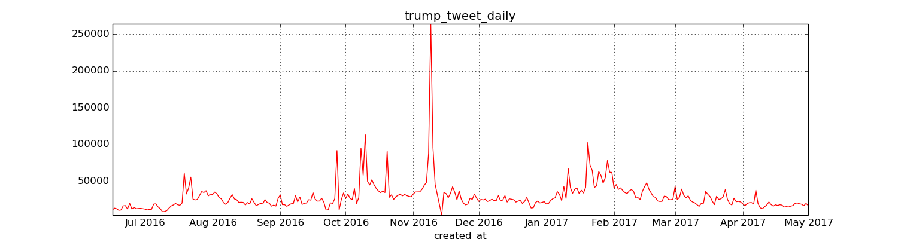
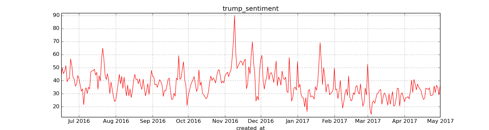

# Simple Text Mining of tweets with keywords 'Trump' on Spark

Trump won the 2016 election, with a very active (and successful) campaign on Twitter. Two years later, it’s still interesting to investigate how was the general public opinion about Trump and who was leading the discussion to promote Trump image.
We were provided with a JSON file collected from Twitter API with about 18M historical tweets in the period of 1 year from June 2016 to May 2017, including 6 months before and after the election. The data was available on the university’s Hadoop cluster with Spark version 2.4.0 and Python 2.7.6
 
### Frequency and average sentiment of Tweets about Trump 

Without training data, we decided to use the most simple form of sentiment analysis: counting number of sentiment words using the [Bing Lexicon]( https://www.cs.uic.edu/~liub/FBS/sentiment-analysis.html) as the reference. Clearly, number of tweets peaked on Novenber 2016, when the President Election took place.  

Interestingly, the average of sentiment score is always positive, before and after the election. Is this the result of Trump's campaign, or is this really the general's public opinion about Trump on Twitter? We will look into the most active users in this topic to evaluate this findings.

### Opinion Leaders and their average sentiment
We combine three criteria of opinion leader to identify top ranked users leading the discourse about Trump on Twitter: 

##### Knowledge Influence (number of tweets)   
   

##### Mentioned Influence 
  

##### Indegree Influence (number of followers)   
  

It turns out that opinion leaders are either Trump and his own supporters (his family members!) or news media agency such as CNN, ABC, FoxNews... and all of them were tweeting only positive/neutral post about Trump and the Election. Majority of most active users also posted positively in general. However, when we look at the average sentiment of tweets mention Trump in particular, the sentiment is actually negative, while Hilary Clinton is mentioned more positively.  

However, this results is only the general overview using bag of words method. We can only conclude on the effectiveness of Trump's Twitter strategy in drawing the attention towards his presidency.

### More analysis needed!

Clearly, the lexicon method to obtain sentiment score is very biased, we have overlooked many aspect of the tweets content, including the use of emojis, topics, sarcasm, etc..  

Without training data, Spark LDA can be a better method to for content analysis on Spark to cluster topics of tweets collection! (We will continue with LDA soon!)
